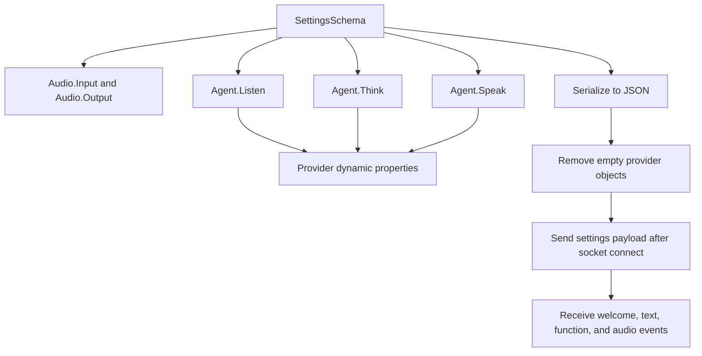

`AgentWebSocketClient` is the most compositional API in the SDK. Instead of representing one product endpoint, it packages a multi-stage conversation pipeline: audio input and output configuration, speech recognition, reasoning, speech generation, and optional function calling. The key request type is `Deepgram.Models.Agent.v2.WebSocket.SettingsSchema`.

The important implementation files are `Deepgram/Clients/Agent/v2/Websocket/Client.cs`, `Deepgram/Models/Agent/v2/WebSocket/Settings.cs`, `Deepgram/Models/Agent/v2/WebSocket/Agent.cs`, `Deepgram/Models/Agent/v2/WebSocket/Provider.cs`, and `Deepgram/Models/Agent/v2/WebSocket/FunctionCallResponseSchema.cs`.

## Why this concept exists

Agent sessions need more than a transcription stream or a TTS stream. They need a single live session that knows how to listen, think, and speak, and they often need to integrate other providers like OpenAI-style LLMs or custom endpoints. The SDK turns that complex payload into a typed model with enough escape hatches to support provider-specific configuration.

## How it relates to other concepts

- It shares the same WebSocket lifecycle and subscription model as [Streaming Transcription](/docs/streaming-transcription).
- It internally models STT, LLM, and TTS configuration together, so it overlaps conceptually with both speech and text features.
- It often pairs with `Deepgram.Microphone.Microphone` because agent sessions usually start from live audio capture.

## How it works internally

`SettingsSchema` contains top-level `Audio` and `Agent` objects. `Audio.Input` and `Audio.Output` carry formats like `linear16`, sample rate, and container settings. `Agent` contains nested `Listen`, `Think`, and `Speak` records, each of which exposes a `Provider`. The interesting part is `Provider.cs`: it inherits from `DynamicObject`, stores arbitrary JSON in `AdditionalProperties`, and converts C# dynamic member names to `snake_case` before serialization. That is how example code can write values like `settingsConfiguration.Agent.Think.Provider.Model = "gpt-4o-mini"` even though `Provider` only declares `Type` explicitly.

In `Deepgram/Clients/Agent/v2/Websocket/Client.cs`, `Connect(SettingsSchema, ...)` first opens the socket with `base.Connect`, then serializes `SettingsSchema` to JSON. Before sending the payload, the client removes empty nested provider objects from `agent.think`, `agent.speak`, and `agent.listen`. That cleanup avoids shipping empty `{}` objects for sections the caller did not configure. After the cleaned JSON is sent, the client can optionally start a keepalive loop and then publish events such as `WelcomeResponse`, `ConversationTextResponse`, `AgentThinkingResponse`, `AudioResponse`, `FunctionCallRequestResponse`, and `AgentAudioDoneResponse`.



## Basic usage

```csharp
using Deepgram;
using Deepgram.Models.Agent.v2.WebSocket;

var client = ClientFactory.CreateAgentWebSocketClient();

var settings = new SettingsSchema();
settings.Agent.Greeting = "Hello! How can I help?";
settings.Agent.Listen.Provider.Type = "deepgram";
settings.Agent.Listen.Provider.Model = "nova-3";
settings.Agent.Think.Provider.Type = "open_ai";
settings.Agent.Think.Provider.Model = "gpt-4o-mini";
settings.Agent.Speak.Provider.Type = "deepgram";
settings.Agent.Speak.Provider.Model = "aura-2-thalia-en";

await client.Subscribe(new EventHandler<ConversationTextResponse>((_, e) =>
{
    Console.WriteLine(e.ToString());
}));

await client.Connect(settings);
await client.SendInjectUserMessage("Summarize today's support queue.");
```

## Advanced usage

```csharp
using Deepgram;
using Deepgram.Models.Agent.v2.WebSocket;

var client = ClientFactory.CreateAgentWebSocketClient();

var settings = new SettingsSchema
{
    Experimental = true,
    Tags = new List<string> { "support-bot", "dotnet" }
};

settings.Audio.Input.Encoding = "linear16";
settings.Audio.Input.SampleRate = 24000;
settings.Audio.Output.Encoding = "linear16";
settings.Audio.Output.SampleRate = 24000;
settings.Audio.Output.Container = "none";

settings.Agent.Think.Provider.Type = "open_ai";
settings.Agent.Think.Provider.Model = "gpt-4o-mini";
settings.Agent.Think.Functions = new List<Function>
{
    new Function
    {
        Name = "lookup_ticket",
        Description = "Fetch a ticket by id"
    }
};

await client.Subscribe(new EventHandler<FunctionCallRequestResponse>(async (_, e) =>
{
    var result = new FunctionCallResponseSchema
    {
        FunctionCallId = e.FunctionCallId,
        Output = "{"status":"open","priority":"high"}"
    };

    var payload = System.Text.Encoding.UTF8.GetBytes(result.ToString());
    await client.SendMessageImmediately(payload);
}));

await client.Connect(settings);
```

<Callout type="warn">The provider objects in the agent schema are intentionally dynamic. That makes the API flexible, but it also means property names are not compile-time validated the way normal strongly typed models are. A misspelled provider-specific property will still serialize, and the server is the component that ultimately rejects or ignores it.</Callout>

<Accordions>
<Accordion title="Strongly typed shell vs dynamic provider payloads">
The agent schema is a deliberate compromise. `SettingsSchema`, `Audio`, `Agent`, `Listen`, `Think`, and `Speak` are strongly typed enough to guide the overall structure, while `Provider` remains dynamic so the SDK does not need a new class every time a provider adds a proprietary field. That flexibility is powerful for experimentation and third-party integrations, but it reduces editor-time safety compared with the rest of the SDK. When you need reliability, build small helper methods in your own codebase that set known-good provider keys in one place.

```csharp
settings.Agent.Think.Provider.Type = "open_ai";
settings.Agent.Think.Provider.Model = "gpt-4o-mini";
settings.Agent.Listen.Provider.Keyterms = new List<string> { "Deepgram" };
```

</Accordion>
<Accordion title="Injected text vs live microphone audio">
`SendInjectUserMessage` is the simplest way to drive an agent because it lets you send a structured text message without managing raw audio. Live microphone audio feels more natural and better matches production voice experiences, but it adds capture, timing, and playback complexity. The trade-off is development speed versus realism: injected text is excellent for testing prompts and function calls, while microphone streaming is the right path for end-to-end voice validation. Teams usually move faster if they stabilize agent behavior with injected text first and add audio transport second.

```csharp
await client.SendInjectUserMessage("What can you do?");
client.SendBinary(audioChunk);
```

</Accordion>
</Accordions>
