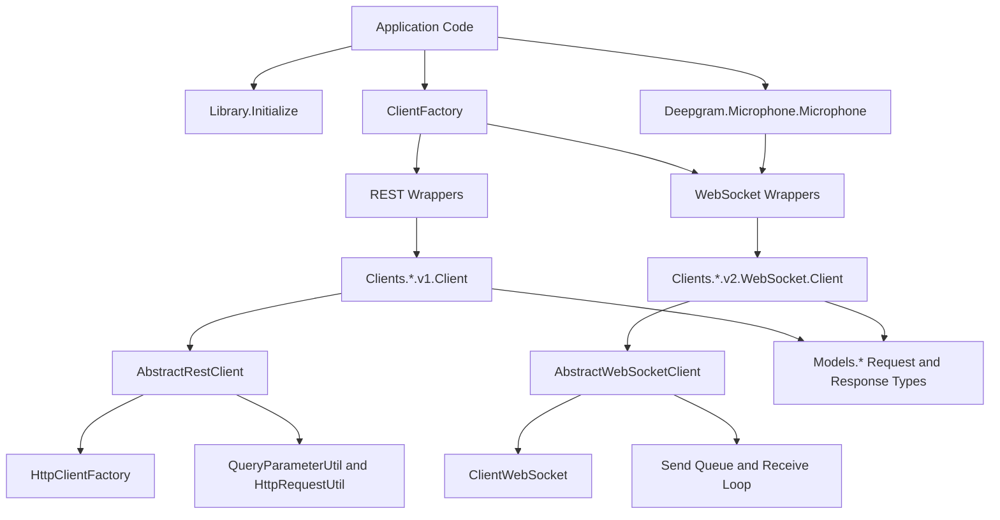
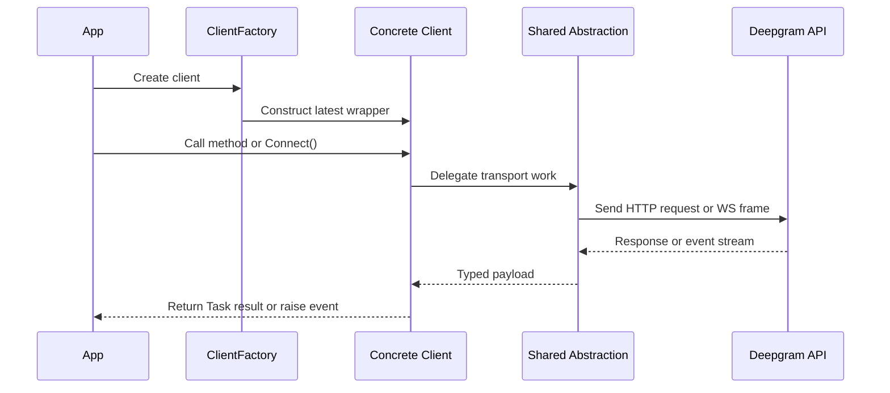
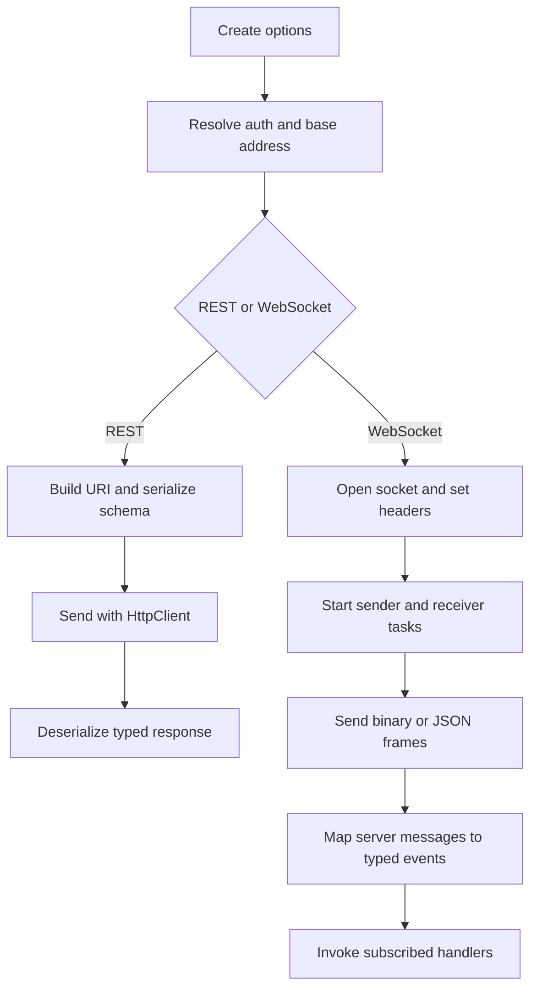

The SDK is organized around a small public surface in the `Deepgram` namespace and a larger implementation surface in `Deepgram.Clients.*`, `Deepgram.Abstractions.*`, and `Deepgram.Models.*`. The public wrappers such as `ListenRESTClient`, `AnalyzeClient`, and `SpeakWebSocketClient` are intentionally thin; the actual behavior lives in the versioned client implementations and shared abstractions.

## Key Design Decisions

### Product wrappers stay thin

The public classes in `Deepgram/ListenRESTClient.cs`, `Deepgram/AnalyzeClient.cs`, `Deepgram/SpeakWebSocketClient.cs`, and related files do almost nothing except inherit from the current versioned client implementation. That keeps application code stable while Deepgram can move implementation details forward behind those wrappers. The same pattern appears in `ClientFactory.cs`, where `CreateListenWebSocketClient()` returns the newest interface while overloads with an explicit version number preserve compatibility for older code.

### Shared REST behavior is centralized

`Deepgram/Abstractions/v1/AbstractRestClient.cs` owns common REST behavior: default timeout creation, query-string formatting, header injection, payload creation, response deserialization, and exception handling. Concrete clients such as `Deepgram/Clients/Listen/v1/REST/Client.cs` and `Deepgram/Clients/Analyze/v1/Client.cs` mostly decide which URI segment to hit and which schema or source type to serialize. That keeps endpoint-specific classes readable and reduces the chance of behavior drifting between products.

### Shared WebSocket behavior is centralized

`Deepgram/Abstractions/v2/AbstractWebSocketClient.cs` owns connection setup, authentication headers, subscription registration, send mutexes, receive loops, and queued or immediate message sending. Product clients such as `Deepgram/Clients/Listen/v2/WebSocket/Client.cs`, `Deepgram/Clients/Speak/v2/WebSocket/Client.cs`, and `Deepgram/Clients/Agent/v2/Websocket/Client.cs` extend that base to interpret product-specific events and start specialized background workers like keepalive or autoflush. The result is that event models differ by product, but the connection lifecycle stays consistent.

### Authentication is resolved once in options

`Deepgram/Models/Authenticate/v1/DeepgramHttpClientOptions.cs` and `Deepgram/Models/Authenticate/v1/DeepgramWsClientOptions.cs` do more than hold properties. They normalize base addresses, append API versions, load credentials from parameters or environment variables, and enforce that cloud deployments have either an API key or an access token. `Deepgram/Factory/HttpClientFactory.cs` and `AbstractWebSocketClient` then consume those resolved credentials to set either `Bearer` or `token` authorization headers.

### Versioning is explicit in namespaces

REST transcription is still surfaced as `Deepgram.Models.Listen.v1.REST`, while live transcription currently uses `Deepgram.Models.Listen.v2.WebSocket`. The agent client also lives in `v2`. This is reflected directly in the folder structure and in `ClientFactory.cs`, where the factory can still instantiate older WebSocket versions for migration scenarios.

## How The Pieces Fit Together

For a REST request, application code usually calls `Library.Initialize()`, builds or omits an options object, and then creates a client through `ClientFactory`. The concrete client picks a URI segment such as `listen`, `read`, `speak`, or `projects/...`, then delegates to `AbstractRestClient` for serialization and transport. `HttpClientFactory.Create()` configures the underlying `HttpClient` with retry policy and `Timeout.InfiniteTimeSpan`, while the SDK relies on per-request `CancellationTokenSource` timeouts instead.

For a WebSocket session, application code creates a client and subscribes to typed events before calling `Connect`. The product client turns a schema like `LiveSchema`, `SpeakSchema`, or `SettingsSchema` into a request URI or first message payload, then calls `AbstractWebSocketClient.Connect`. Once connected, the base class starts sender and receiver background tasks; the concrete client may also start keepalive or autoflush loops. Incoming frames are translated into product-specific response types and published through subscribed handlers.

## Request And Data Lifecycle

In the transcription REST path, `ListenRESTClient.TranscribeUrl` and `TranscribeFile` validate callback usage, build the final URI using `GetUri`, then call `PostAsync` on `AbstractRestClient`. In the TTS REST path, `SpeakRESTClient.ToStream` uses `PostRetrieveLocalFileAsync` so it can combine response metadata headers with the returned audio bytes. In the management path, methods are almost one-to-one mappings to GET, POST, PATCH, and DELETE endpoints.

Streaming clients add one more layer: stateful lifecycle management. `Listen` can optionally send keepalive frames and inspect the time since the last received message to trigger autoflush. `Speak` can queue text, `Flush`, `Clear`, or immediate close messages. `Agent` is more opinionated: after the socket opens, it cleans the serialized `SettingsSchema` JSON, removes empty nested provider objects, and sends the settings payload immediately so the server can start the conversation.

If you are starting implementation work, the most useful next pages are [Client Factory and Options](/docs/client-factory-and-options), [Streaming Transcription](/docs/streaming-transcription), and [API Reference](/docs/api-reference/library-and-client-factory).
