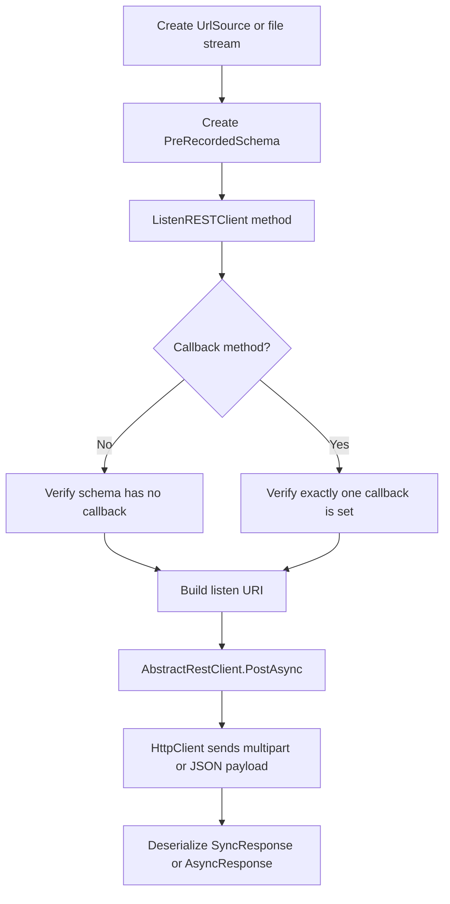

REST transcription is the SDK's batch speech-to-text path. You use `ListenRESTClient` with `UrlSource`, `byte[]`, or `Stream`, and you configure recognition behavior through `PreRecordedSchema`. This is the right model when your audio already exists as a file or URL and you want one complete response instead of a live event stream.

The relevant implementation files are `Deepgram/Clients/Listen/v1/REST/Client.cs`, `Deepgram/Clients/Interfaces/v1/IListenRESTClient.cs`, and `Deepgram/Models/Listen/v1/REST/PreRecordedSchema.cs`.

## Why this concept exists

Uploading or referencing prerecorded audio has different requirements from live streaming. You usually care about richer post-processing features such as summarization, diarization, redaction, topic detection, keywords, or async callbacks. `ListenRESTClient` packages those capabilities into one place and lets you submit either raw file data or a remote URL.

## How it relates to other concepts

- It uses the same factory and option pattern described in [Client Factory and Options](/docs/client-factory-and-options).
- It shares `AbstractRestClient` with analyze, auth, manage, and self-hosted clients.
- It overlaps with [Streaming Transcription](/docs/streaming-transcription) in output shape, but not in transport model or lifecycle.

## How it works internally

`ListenRESTClient` is a thin wrapper over `Deepgram.Clients.Listen.v1.REST.Client`. That class exposes five meaningful paths:

- `TranscribeUrl(UrlSource, PreRecordedSchema?, ...)`
- `TranscribeFile(byte[], PreRecordedSchema?, ...)`
- `TranscribeFile(Stream, PreRecordedSchema?, ...)`
- `TranscribeUrlCallBack(UrlSource, string?, PreRecordedSchema?, ...)`
- `TranscribeFileCallBack(Stream or byte[], string?, PreRecordedSchema?, ...)`

Inside `Client.cs`, synchronous methods call `VerifyNoCallBack` to reject any schema that already contains `CallBack`. Async callback methods call `VerifyOneCallBackSet` to ensure you set a callback exactly once, either in the explicit `callBack` argument or in `PreRecordedSchema.CallBack`. After that validation, the client builds the `listen` URI and delegates to `PostAsync` from `AbstractRestClient`.

That means the request lifecycle is:



## Basic usage

```csharp
using Deepgram;
using Deepgram.Models.Listen.v1.REST;

var client = ClientFactory.CreateListenRESTClient();

var response = await client.TranscribeFile(
    File.ReadAllBytes("meeting.wav"),
    new PreRecordedSchema
    {
        Model = "nova-3",
        Punctuate = true,
        SmartFormat = true,
        Diarize = true
    });

Console.WriteLine(response.Results?.Channels?[0].Alternatives?[0].Transcript);
```

## Advanced usage

```csharp
using Deepgram;
using Deepgram.Models.Listen.v1.REST;

var client = ClientFactory.CreateListenRESTClient();

var response = await client.TranscribeUrlCallBack(
    new UrlSource("https://dpgr.am/bueller.wav"),
    "https://example.com/webhooks/deepgram",
    new PreRecordedSchema
    {
        Model = "nova-3",
        DetectEntities = true,
        DetectTopics = true,
        Search = new List<string> { "Ferris", "Bueller" },
        Extra = new Dictionary<string, string>
        {
            ["job_id"] = "sync-4421"
        }
    });

Console.WriteLine($"Request ID: {response.RequestId}");
```

<Callout type="warn">Do not set `PreRecordedSchema.CallBack` and also pass the `callBack` method argument. `VerifyOneCallBackSet` in `Deepgram/Clients/Listen/v1/REST/Client.cs` treats that as an error and throws `ArgumentException`.</Callout>

<Accordions>
<Accordion title="URL submission vs file upload">
`TranscribeUrl` is ideal when your media already lives in object storage or on a public HTTPS endpoint because the SDK only sends a small JSON body containing the URL. `TranscribeFile` is better when the media is private, local, or generated in memory, but it necessarily moves more bytes through your process. The trade-off is between network control and operational simplicity: URL mode reduces upload cost from your app, while file mode gives you full ownership over the bytes you submit. If you are processing user uploads that never become publicly reachable, file upload is usually the safer choice.

```csharp
await client.TranscribeUrl(new UrlSource(remoteUrl), schema);
await client.TranscribeFile(File.OpenRead("private.wav"), schema);
```

</Accordion>
<Accordion title="Synchronous responses vs callback workflows">
Synchronous transcription keeps your control flow simple because the method returns a `SyncResponse` directly. Callback workflows are more scalable for long recordings and background processing, but they move complexity into your webhook handler and job orchestration. The SDK deliberately separates these paths so your code cannot accidentally ask for a synchronous return while also embedding a callback URL in the schema. If your application already has durable job tracking and webhook infrastructure, the callback methods are a better fit for large media workloads.

```csharp
var sync = await client.TranscribeFile(bytes, schema);
var asyncJob = await client.TranscribeFileCallBack(bytes, callbackUrl, schema);
```

</Accordion>
</Accordions>
