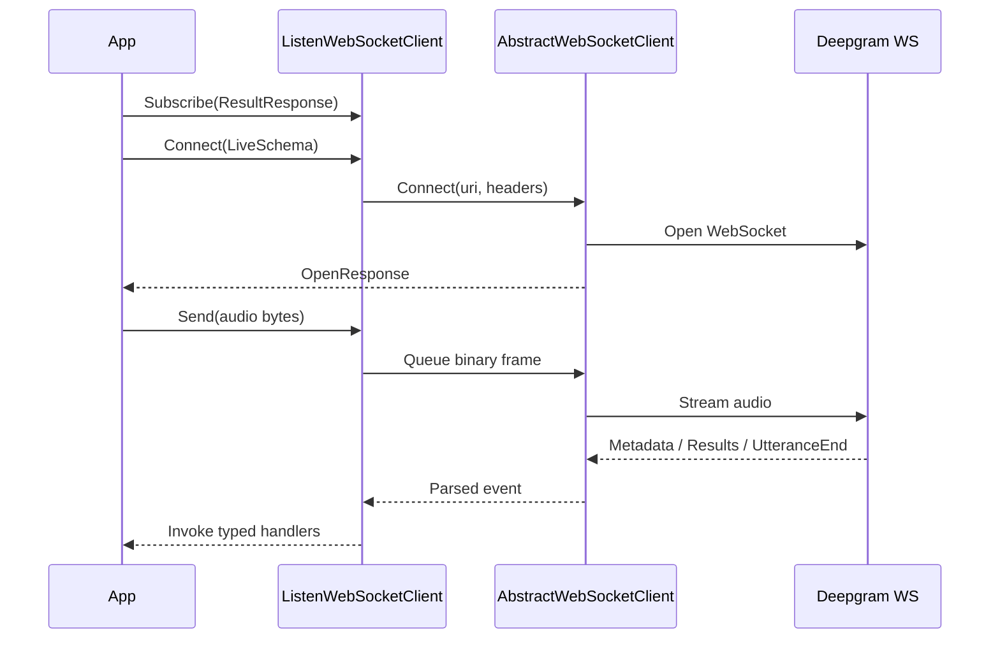

Streaming transcription is built around `ListenWebSocketClient` and `Deepgram.Models.Listen.v2.WebSocket.LiveSchema`. It is the SDK's low-latency path for microphones, ongoing calls, and any scenario where audio arrives continuously and the application reacts to partial or final transcripts in real time.

The core implementation is in `Deepgram/Clients/Listen/v2/WebSocket/Client.cs`, `Deepgram/Abstractions/v2/AbstractWebSocketClient.cs`, and `Deepgram/Models/Listen/v2/WebSocket/LiveSchema.cs`.

## Why this concept exists

Live transcription needs stateful connection management that a REST request cannot provide. The SDK needs to open a socket, stream binary audio frames, listen for server events, optionally send keepalive frames, and sometimes autoflush a stream when the server has stopped hearing audio. That behavior is separate enough from batch transcription that it deserves its own client and schema model.

## How it relates to other concepts

- It uses `DeepgramWsClientOptions`, not `DeepgramHttpClientOptions`.
- It pairs naturally with `Deepgram.Microphone.Microphone` for real microphone capture.
- Its architecture is almost identical to the streaming TTS and agent clients, but the event types and control messages differ.

## How it works internally

`ListenWebSocketClient` inherits the current implementation from `Deepgram.Clients.Listen.v2.WebSocket.Client`. `Connect(LiveSchema, ...)` first checks one notable invariant in `Client.cs`: if the model does not start with `nova-3` and you set `Keyterm`, the method throws `DeepgramException`, because keyterm prompting is restricted to Nova 3 models in this implementation.

Once validation passes, the client builds the WebSocket URI from the schema and `DeepgramWsClientOptions`, then calls `AbstractWebSocketClient.Connect`. The base class sets auth headers, opens `ClientWebSocket`, and starts sender and receiver background threads. The listen-specific client may start two more loops:

- a keepalive loop when `DeepgramWsClientOptions.KeepAlive` is `true`
- an autoflush loop when `AutoFlushReplyDelta > 0`

Incoming WebSocket messages are converted into typed events like `MetadataResponse`, `ResultResponse`, `UtteranceEndResponse`, and `SpeechStartedResponse`. Subscription is typed and additive; every `Subscribe(...)` call adds another handler to the underlying event.



## Basic usage

```csharp
using Deepgram;
using Deepgram.Models.Listen.v2.WebSocket;

var client = ClientFactory.CreateListenWebSocketClient();

await client.Subscribe(new EventHandler<ResultResponse>((_, e) =>
{
    var transcript = e.Channel?.Alternatives?[0].Transcript;
    if (!string.IsNullOrWhiteSpace(transcript))
    {
        Console.WriteLine(transcript);
    }
}));

var connected = await client.Connect(new LiveSchema
{
    Model = "nova-3",
    Encoding = "linear16",
    SampleRate = 16000,
    InterimResults = true,
    Punctuate = true
});

if (connected)
{
    client.Send(File.ReadAllBytes("chunk.raw"));
    await client.Stop();
}
```

## Advanced usage

```csharp
using Deepgram;
using Deepgram.Microphone;
using Deepgram.Models.Authenticate.v1;
using Deepgram.Models.Listen.v2.WebSocket;

Deepgram.Library.Initialize();
Deepgram.Microphone.Library.Initialize();

var options = new DeepgramWsClientOptions(
    keepAlive: true,
    addons: new Dictionary<string, string>
    {
        ["auto_flush_reply_delta"] = "2000"
    });

var client = ClientFactory.CreateListenWebSocketClient(options: options);

await client.Subscribe(new EventHandler<UtteranceEndResponse>((_, e) =>
{
    Console.WriteLine($"Utterance ended: {e.LastWordEnd}");
}));

await client.Connect(new LiveSchema
{
    Model = "nova-3",
    Encoding = "linear16",
    SampleRate = 16000,
    SmartFormat = true,
    VadEvents = true,
    UtteranceEnd = "1000"
});

var microphone = new Microphone(client.Send, rate: 16000, channels: 1);
microphone.Start();

Console.ReadKey();
microphone.Stop();
await client.Stop();

Deepgram.Microphone.Library.Terminate();
Deepgram.Library.Terminate();
```

<Callout type="warn">`Keyterm` is not a generic streaming option in this SDK. `Deepgram/Clients/Listen/v2/WebSocket/Client.cs` explicitly throws if you set `LiveSchema.Keyterm` on a model that does not start with `nova-3`.</Callout>

<Accordions>
<Accordion title="Queued sends vs immediate sends">
Most application code should use `Send`, `SendBinary`, or `SendMessage`, because they preserve ordering through the send queue managed by `AbstractWebSocketClient`. Immediate send methods exist for control cases like close, keepalive, or product-specific urgent frames, but they deliberately bypass normal queue timing. The trade-off is latency versus ordering guarantees: immediate sends reduce delay, but they can interleave with your queued stream in ways that are harder to reason about. For raw audio chunks, stick to queued sends unless you are extending the SDK itself.

```csharp
client.Send(audioChunk);
await client.SendMessageImmediately(controlBytes);
```

</Accordion>
<Accordion title="Autoflush convenience vs explicit lifecycle control">
`AutoFlushReplyDelta` is useful when your app behaves like push-to-talk and wants the SDK to nudge the stream toward a final result after inactivity. That convenience comes with less explicit control, because the timing is now partly driven by background logic rather than your own call to `SendFinalize()`. If your product has a very clear speech boundary, calling `SendFinalize()` yourself can make behavior easier to debug and test. If your input timing is messy or user-driven, autoflush can remove a surprising amount of edge-case code from the app layer.

```csharp
var options = new DeepgramWsClientOptions(addons: new Dictionary<string, string>
{
    ["auto_flush_reply_delta"] = "1500"
});
await client.SendFinalize();
```

</Accordion>
</Accordions>
